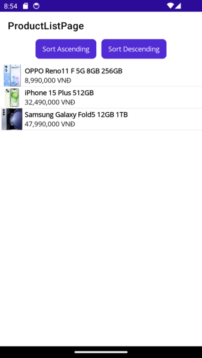
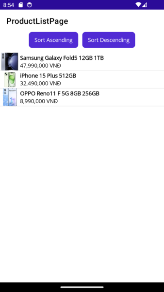
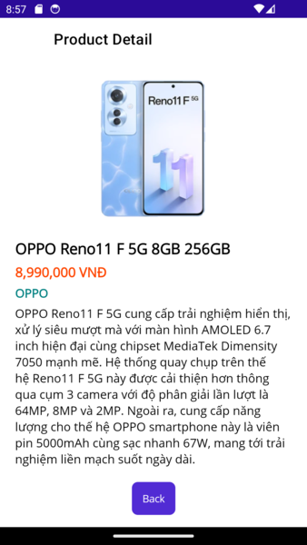

# MAUI Product Viewer App

This is a MAUI (Multi-platform App UI) application that allows users to view a list of products and see their details.

## Screens

### Product List Screen

This screen displays a list of products with their titles, prices, and sample images. Users can click on any product to view its details.

### Product Detail Screen

This screen shows detailed information about a selected product, including its title, description, price, category, and images.

## Data Model

The application uses the following data model for products:

- `Product`: Represents a product with the following properties:
  - `id`: Unique identifier for the product.
  - `title`: Title of the product.
  - `description`: Description of the product.
  - `price`: Price of the product.
  - `category`: Category of the product.
  - `image`: Sample image(s) of the product (can be a list).

## Additional Feature

In the Product List Screen, there is a button to sort the list of products by price in ascending or descending order.

## Technologies Used

- .NET MAUI: Cross-platform framework for building native UIs.
- C#: Programming language used for application logic.
- XAML: Markup language for defining UI elements.

## Getting Started

To run the application, follow these steps:

1. Clone this repository to your local machine.
2. Open the solution file (`MAUIProductViewer.sln`) in Visual Studio.
3. Build and run the application.

## Contributing

Contributions are welcome! If you'd like to contribute to this project, please fork the repository and submit a pull request.

## License

This project is licensed under the [MIT License](LICENSE).

